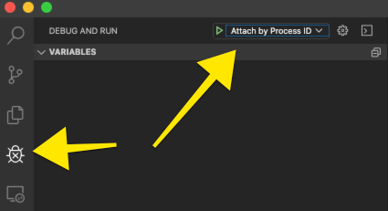
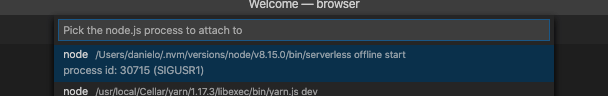

# time-tracking backend

## Methods

- POST users - sign up
- `POST login` - get a JWT token
- `POST services` - create a new time-tracking session
- `GET services` - list all your time-tracking session
- `PATCH services/{id}` - updates an existing time-tracking session
- `DELETE services/{id}` -  deletes an existing time-tracking session

## Setup

```bash
yarn # or npm install
yarn dev # or npm run dev
```

## Run service offline

```bash
serverless offline start
```
or just use the shorthand
```bash
yarn dev
```

### Debug

If you open this folder with VSCode there is an already existing configuration for attach to a running server so the steps are:
1. Start the server offline by running `yarn dev`
2. Open VSCode debug section and select the process that has `serverless offline` on it




## Deployment

run `sls deploy` at the root the `back` folder
